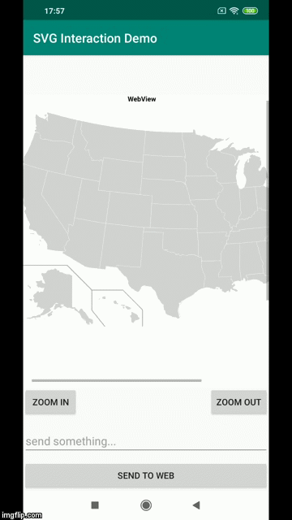

[](https://houndci.com) 
[](https://opensource.org/licenses/Apache-2.0)

# SVGInteractionDemo
**Interactive SVG image in Android app using Kotlin and JavaScript.**
<br/>For detailed explanation please visit the following blog, and don't forget to **clap** as much as you can. Thanks
Medium.com blog:- https://medium.com/@scode43/interactive-svg-image-in-android-app-using-kotlin-and-javascript-6715c16397bb

# Demo


# License
```
                                 Apache License
                           Version 2.0, January 2004
                        http://www.apache.org/licenses/

   Copyright [2020] [A S M Sayem]

   Licensed under the Apache License, Version 2.0 (the "License");
   you may not use this file except in compliance with the License.
   You may obtain a copy of the License at

       http://www.apache.org/licenses/LICENSE-2.0

   Unless required by applicable law or agreed to in writing, software
   distributed under the License is distributed on an "AS IS" BASIS,
   WITHOUT WARRANTIES OR CONDITIONS OF ANY KIND, either express or implied.
   See the License for the specific language governing permissions and
   limitations under the License.

```
